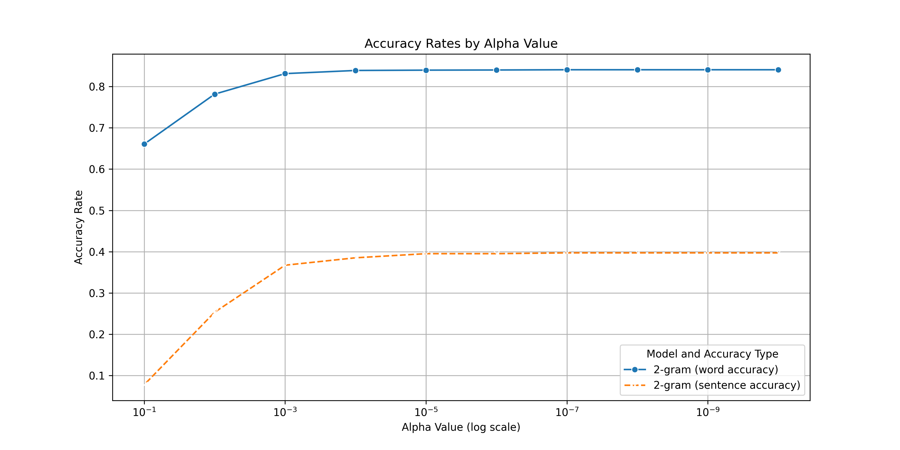
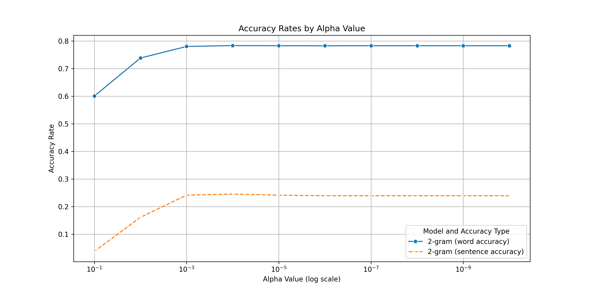
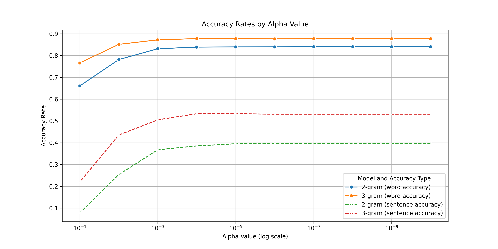
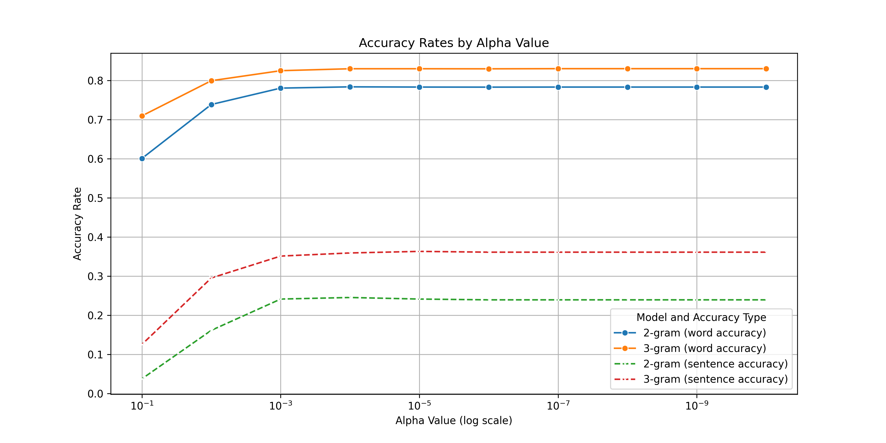
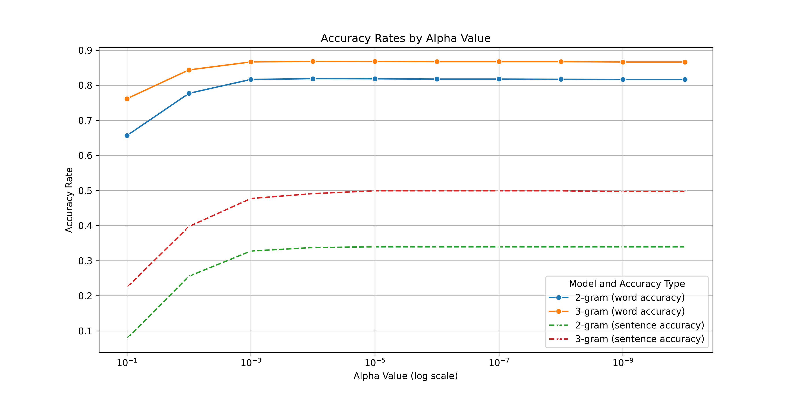

# 第一次作业 拼音输入法

姓名：田仁睿

学号：2024310636

## 必做部分

### I. 实验环境

- 使用 `python` 语言实现，版本为`3.10.12`

- 为了优化训练体验，除 `python3` 标准库外额外使用了 `tqdm` 库，用于呈现训练进度

- 实验运行在 `macOS 15.0.1 arm64` 系统上，内存 16GB

### II. 语料库处理

#### 使用的语料库

**必做要求**中使用的语料库为新浪新闻 2016 年 4 月至 2016 年 11 月共 8 个文件。

语料库文件格式为每行一个 `json` 格式的新闻，各字段内容为：

- `title` : 新闻标题

- `html` : 新闻正文

- `time` : 新闻时间

- `url` : 原文所在 `url`

**选做部分**还使用了来自 GitHub 项目 *[nlp_chinese_corpus](https://github.com/brightmart/nlp_chinese_corpus)* 的以下语料库：

- 维基百科（104万个中文词条）

- 百科类问答（150万个问答）

#### 预处理方式

所有的语料库的数据预处理方式一致：将文本中所有非中文字符视作分隔符，然后统计词频.

对于一二级汉字表中的字，统计其在所有语料中的单字 $w$ 出现频率 $freq_1(w)$ 以及双字 $w_1w_2$ 出现的频率 $freq_2(w_1w_2)$.

然后计算单字 $w$ 在拼音 $\text{pinyin}$ 下的出现概率 $P(w|\text{pinyin})$，以及 $w_2$ 在 $w_1$ 后一个出现的概率 $P(w_2|w_1)$：

$$
\begin{aligned}
P(w|\text{pinyin}) &= \frac{freq_1(w)}{\sum_{v\in word(\text{pinyin})} freq_1(v)}\\\\
P(w_2|w_1) &= \frac{freq_2(w_1w_2)}{\sum_{v\in\sigma} freq_2(w_1v)}
\end{aligned}
$$

之后，基于上面得到的概率信息进行动态规划.

### III. 基于字的二元模型的拼音输入法

#### a. 算法原理

使用基于字的二元模型算法，求解使得 $P(S|O)=\large \frac{P(S)P(O|S)}{P(O)}$ 最大的 $S$.

因为：

$$
\begin{aligned}
P(O) &= const\\\\
P(O|S) &\approx 1\\\\
P(S) &= \prod_i P(w_i|w_1...w_{i-1})
\end{aligned}
$$

所以，需要求 $P(S)=\prod_i P(w_i|w_1...w_{i-1})$ 最大的 $S$.

在基于字的二元模型中：

$$
\begin{aligned}
P(S) &= \prod_i P(w_i|w_{i-1})
\end{aligned}
$$

故问题转化为求 $S$ 使得 $P(S)=\prod_i P(w_i|w_{i-1})$ 最大.

使用 **viterbi** 动态规划算法求解，令 $f_i(w)$ 表示第 $i$ 个字为 $w$ 的概率 $\prod_{j\leq i} P(w_j|w_{j-1})$.

初始状态 $f_1(w)$ 可由 $P(w|\text{pinyin})$ 直接获得.

转移方程如下：

$$
\begin{aligned}
f_i(w_i) = \max_{w_{i-1}} \{f_{i-1}(w_{i-1}) \cdot P(w_i|w_{i-1})\}
\end{aligned}
$$

为了解决 $P(w_i|w_{i-1})$ 可能为 0 的问题，采用数据平滑处理，引入参数 $\alpha$ ：

$$
P'(w_i|w_{i-1}) = (1-\alpha)\cdot P(w_i|w_{i-1}) + \alpha\cdot P(w_i)
$$

#### b. 实验效果

##### 准确率

使用提供的测试语料进行测试，通过变化超参 $\alpha$ 的值，得到以下实验结果：

| $-\log_{10}\alpha$ | 字准确率  | 句准确率  |
| :----------------: | :-------: | :-------: |
|        $1$         | $66.06\%$ | $7.78\%$  |
|        $2$         | $78.15\%$ | $25.34\%$ |
|        $3$         | $83.11\%$ | $36.72\%$ |
|        $4$         | $83.88\%$ | $38.52\%$ |
|        $5$         | $83.95\%$ | $39.52\%$ |
|        $6$         | $83.99\%$ | $39.52\%$ |
|        $7$         | $84.04\%$ | $39.72\%$ |
|        $8$         | $84.04\%$ | $39.72\%$ |
|        $9$         | $84.04\%$ | $39.72\%$ |
|        $10$        | $84.04\%$ | $39.72\%$ |

从表中来看， $\alpha$ 的值在 $10^{-7}$ 左右，推测准确率最佳。

##### 训练时长与总时长

- 训练主要耗时在语料库文件 IO ，耗时约 5 分半

- 训练完成后，生成预测结果所需时间约 2 秒

- 总时长约 5 分半

#### c. 样例分析

对于提供的测试语料，该输入法的字准确率较高（约 $84\%$），但句准确率缺较低（不超过 $40\%$）。

选取效果好的样例分析：

- **正确样例**
  
  - 人民群众喜闻乐见

  - 中国人民感谢你们

  - 小猫喵喵叫

- **正确原因分析**

  - “人民群众”，“中国人民”，“感谢你们”，“喜闻乐见”这样的词汇在新闻中出现的频率很高
  
  - “喵喵叫”属于比较特殊的词，很少有与之相同拼音的词，所以难以出错
  

选取效果差的样例分析：

- **错误样例** （正确样例 / 错误样例）

  - 成本压力也不容小觑 / 成本压力也不容小区

  - 青花瓷真正成为中国瓷器的主流 / 清华慈真正成为中国瓷器的主流

  - 以诚挚的祝贺和美好的祝愿 / 以诚挚的祝贺和美好的住院

  - 北京大学比清华大学好 / 北京大雪碧清华大学好

  - 戴口罩防止交叉传染 / 大口罩防止交叉感染

- **错误原因分析**

  - “不容小区”、“青花瓷”拼写错误一方面可能是因为训练数据中这两个词的频率较低，另一方面也是受限于基于字的**二元**模型难以准确预测两个字以上的词

  - “美好的住院”，“北京大雪碧”拼写错误主要是由于基于**字**的二元模型的局限性，很难形成“…的…”、“...比...” 这样的句式

  - “大口罩”拼写出错主要是因为语料库中并未对汉字进行注音处理，所以在构建模型时，对每个字的所有拼音都进行了字频统计，导致该模型对多音字的处理效果不佳

### IV. 思考题

**a. 简述 gbk 和 utf-8 的区别。是否存在其他编码方式？若有，请罗列至少一种并且陈述其作用**

区别：

- **gbk**：单双字节变长编码，主要用于简体中文，可表示约 21000 个汉字，兼容性差
- **utf-8**：针对 Unicode 的可变长度字符编码，使用 1 至 4 个字节表示一个字符，可以表示几乎所有字符，兼容性更好

其他编码方式：

- **ISO-8859-1（Latin-1）**

- 作用：单字节编码，主要用于西欧语言，包括基本拉丁字母、一些标点符号及常用的欧洲字符

**b. 试分析 viterbi 算法的时间复杂度和空间复杂度**

设预测字串长度为 $n$ ，字符集大小 $|\sigma|$ 为 $m$.

- 时间复杂度：在字串的每个位置进行动态规划，状态转移次数为 $O(m^2)$，故总时间复杂度为 $O(nm^2)$
- 空间复杂度：可以使用滚动数组优化存储空间，但是由于需要记录动态规划的完整转移路径，该部分空间无法优化，故空间复杂度仍然为 $O(nm)$
- 注意到，由于已知每个位置的拼音，故实际合法的状态远低于 $m$ ，以上给出的复杂度上界非常宽松

**c. 以下是两段伪代码及对应终端输出，题目要求原样输出程序的输入，从标准输入中读入数据，输出到标准输出。仅从输入输出⻆度出发，不考虑异常和特殊情况，陈述两种代码的区别并分别判断正误**

区别：

- 代码 A 是接收一个输入后立刻输出原数据，直至循环退出
- 代码 B 是在循环中将接收的输入按顺序存储，循环退出后在按照顺序输出

判断：二者均正确。

## 选做部分

### I. 不同语料库对比

仍然采用基于字的二元模型算法，使用的测试集为作业文件提供的测试集.

语料库除了使用作业文件提供的新浪新闻语料库之外，还包括了以下语料库（来源：https://github.com/brightmart/nlp_chinese_corpus)：

- 维基百科（104 万个中文词条）
- 百科类问答（150 万个问答）

#### 维基百科

| $-\log_{10}\alpha$ | 字准确率  | 句准确率  |
| :----------------: | :-------: | :-------: |
|        $1$         | $60.08\%$ | $3.79\%$  |
|        $2$         | $73.85\%$ | $16.17\%$ |
|        $3$         | $78.03\%$ | $24.15\%$ |
|        $4$         | $78.36\%$ | $24.55\%$ |
|        $5$         | $78.30\%$ | $24.15\%$ |
|        $6$         | $78.28\%$ | $23.95\%$ |
|        $7$         | $78.30\%$ | $23.95\%$ |
|        $8$         | $78.30\%$ | $23.95\%$ |
|        $9$         | $78.30\%$ | $23.95\%$ |
|        $10$        | $78.30\%$ | $23.95\%$ |

#### 百科问答

| $-\log_{10}\alpha$ | 字准确率  | 句准确率  |
| :----------------: | :-------: | :-------: |
|        $1$         | $65.64\%$ | $7.78\%$  |
|        $2$         | $77.67\%$ | $25.55\%$ |
|        $3$         | $81.64\%$ | $32.73\%$ |
|        $4$         | $81.85\%$ | $33.73\%$ |
|        $5$         | $81.81\%$ | $33.93\%$ |
|        $6$         | $81.74\%$ | $33.93\%$ |
|        $7$         | $81.74\%$ | $33.93\%$ |
|        $8$         | $81.68\%$ | $33.93\%$ |
|        $9$         | $81.62\%$ | $33.93\%$ |
|        $10$        | $81.62\%$ | $33.93\%$ |

#### 最佳效果对比

|  语料库  | 字准确率  | 句准确率  |
| :------: | :-------: | :-------: |
| 新浪新闻 | $84.04\%$ | $39.72\%$ |
| 维基百科 | $78.36\%$ | $24.55\%$ |
| 百科问答 | $81.81\%$ | $33.93\%$ |

#### 结果分析

综合来看，语料库训练效果上：新浪新闻 > 百科问答 > 维基百科；但数据规模上：维基百科 > 百科问答 > 新浪新闻。

造成如此反常的结果的原因是：

- 测试集以日常用语为主，与日常话题紧密相关的新闻语料训练出来的输入法表现更好

- 百科问答中的用语日常化稍低一些，规范化更高一些，所以在该测试集下表现稍差

- 维基百科中的用语日常化更低，规范化更高，因此在该测试集下表现最差

### II. 基于字的三元模型

#### a. 算法原理

与基于字的二元模型类似，问题转化为求解  $P(S)=\prod_i P(w_i|w_1...w_{i-1})$ 最大的 $S$.

在基于字的三元模型中：

$$
\begin{aligned}
P(S) &= \prod_i P(w_i|w_{i-2}w_{i-1})
\end{aligned}
$$

同样利用 **viterbi** 动态规划算法求解即可.

由于语料库中存在的二元词组很多，所以代码实现时仅选择出现次数最多的前 10 万个二元组 $w_{i-2}w_{i-1}$ ，然后统计在 $w_{i-2}w_{i-1}$ 之后出现 $w_i$ 的频率来计算 $P(w_i|w_{i-2}w_{i-1})$.

这样处理带来的问题是无法统计所有的 $P(w_i|w_{i-1}w_{i-2})$ ，因此采用平滑处理，同时加入二元模型的动态规划进行补偿.

令 $f_i(w)$ 表示第 $i$ 个字为 $w$ 的概率， $g_i(vw)$ 表示第 $i-1$ 和第 $i$ 个字分别为 $v$ 和 $w$ 的概率.

动态规划转移方程如下：

$$ 
\begin{aligned} 
f_i(w_i) &= \max\{\max_{w_{i-1}} \{f_{i-1}(w_{i-1}) \cdot P(w_i|w_{i-1})\}, \max_{w_{i-2}w_{i-1}}\{g_{i-1}(w_{i-2}w_{i-1}) \cdot P'(w_i|w_{i-2}w_{i-1})\}\} \\
g_i(w_{i-1}w_i) &= \max\{\max_{w_{i-1}} f_{i-1}(w_{i-1}) \cdot P'(w_i|w_{i-1}), \max_{w_{i-2}w_{i-1}}\{g_{i-1}(w_{i-2}w_{i-1}) \cdot P'(w_i|w_{i-2}w_{i-1})\}\} 
\end{aligned} 
$$

#### b. 实验效果

采用新浪新闻、维基百科、百科问答三种语料库分别训练，并在测试集上评测准确率。

##### 新浪新闻

| 模型 | 字准确率  | 句准确率  |
| :--: | :-------: | :-------: |
| 二元 | $84.04\%$ | $39.72\%$ |
| 三元 | $87.77\%$ | $53.29\%$ |

##### 维基百科

| 模型 | 字准确率  | 句准确率  |
| :--: | :-------: | :-------: |
| 二元 | $78.36\%$ | $24.55\%$ |
| 三元 | $82.98\%$ | $36.32\%$ |

##### 百科问答

| 模型 | 字准确率  | 句准确率  |
| :--: | :-------: | :-------: |
| 二元 | $81.81\%$ | $33.93\%$ |
| 三元 | $86.76\%$ | $49.90\%$ |

##### 结果分析

- **准确度**：在不同的语料集上，基于字的三元模型相比基于字的二元模型有显著的准确率提升
- **训练时长**：以新浪新闻语料为例，统计三元组的词频耗时约 8 分钟，再加上二元模型的训练时长，总训练时长为二元模型的 2 到 3 倍
- **预测时长**：三元模型生成所有测试样例结果耗时约 15 秒，明显慢于二元模型（约 2 秒），但仍可以接受

#### c. 样例分析

句准确率的上限在 $50\%$ 左右，可能的原因是语料库没有涵盖测试集的所有用语风格以及基于字的模型的局限性。

**纠正的样例** （二元模型处理样例 / 三元模型处理样例）

- 我想出门牌照了 / 我想出门拍照了

- 疫情以来的一次在外就餐 / 疫情以来第一次在外就餐

- 毛泽东思想和中国特色社会主义理论体系该论 / 毛泽东思想和中国特色社会主义理论体系概论

**原因分析**

- 三元模型对一些三、四元词有了更好的补充，如“人际关系”、“第一次”、“体系概论”和“出门拍照”等

------

**纠错的样例**（二元模型处理样例 / 三元模型处理样例）

- 翻译翻译什么叫惊喜 / 翻一番以什么叫惊喜

- 前方高能非战斗人员轻快速撤离 / 前方高能飞战斗人员轻快速撤离

- 可圈可点 / 科全科电

- 作业需要手写 / 作也需要手写

**原因分析**

- 如前所述，三元模型只采样了出现频率较高的二元词及其后一个字，无法覆盖所有的三元词

- 语料库中“翻译翻译”、“非战斗人员”、“可圈可点”和“作业需要”等相关词出现频率较低，导致三元模型推测错误

------

**未纠正的样例**（二元模型处理样例 / 三元模型处理样例 / 正确样例）

- 北京市首个举办过夏奥会与冬奥会的城市 / 北京市首个举办过夏奥会于冬奥会的城市 / 北京是首个举办过夏奥会与冬奥会的城市

**原因分析**

- 基于字的模型无法对句子进行正确分词，也无法理解句意，难以将“北京市|...”纠正为“北京|是|...”，把“夏奥会|于|冬奥会”纠正为“夏奥会|与|冬奥会”

## 总结与建议

实验约 3 天完成，主要耗时是在统计词频的训练过程中，需要处理大量数据，工作量较大。通过这次实验，对基于字模型的拼音输入法有了更深的理解，也认识到基于字的模型在实际应用时所面临的各种局限性，想要获取更好的拼音输入体验，必须要寻求新的算法。

对本次作业实验的一点建议：个人认为思考题 a 和 c 与拼音输入法算法并不相关，不太有必要作为作业内容。
